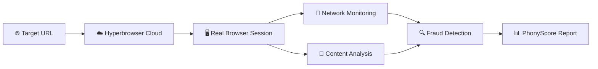

# 🛡️ Scam Scanner – Intelligent Scam Store Scanner

> **Powered by [Hyperbrowser.ai](https://hyperbrowser.ai) – Real browsers in the cloud**

**One command. One scan. Instant fraud detection.**

This tool leverages Hyperbrowser's cloud-based browser infrastructure to perform deep analysis of suspicious online stores, detecting fraud patterns that traditional crawlers miss.

---

## 🚀 **Why Hyperbrowser Makes the Difference**

### Traditional Crawlers vs. Hyperbrowser
| Traditional Crawlers | 🌟 **Hyperbrowser** |
|---------------------|---------------------|
| ❌ Miss JavaScript-loaded content | ✅ **Full JS execution** – sees dynamic content |
| ❌ Can't detect redirects | ✅ **Real browser behavior** – catches all redirects |
| ❌ Limited to static HTML | ✅ **Complete rendering** – captures post-load fraud tactics |
| ❌ Require local Chrome setup | ✅ **Zero setup** – everything runs in the cloud |

### 🎯 **What Scam-Scanner Detects**
- 🔓 **Insecure HTTP assets** on HTTPS sites
- ⚠️ **Failed API calls** (4xx/5xx errors)
- 🏦 **Suspicious payment iframes** from unknown providers
- 📅 **Brand-new domains** with missing legal pages
- 🖼️ **Duplicate stock photos** (coming soon)

---

## 📦 **Quick Start**

### 1️⃣ **Get Your Hyperbrowser API Key**
🔑 **[Get your free API key at hyperbrowser.ai →](https://hyperbrowser.ai)**

### 2️⃣ **Install & Setup**
```bash
# Clone the repository
git clone https://github.com/hyperbrowserai/examples
cd scam-scanner-bot

# Install dependencies
pnpm install        # or npm install

# Configure your API keys
cp .env.example .env
```

### 3️⃣ **Add Your Keys to `.env`**
```env
# 🔑 Get this at hyperbrowser.ai
HYPERBROWSER_API_KEY=pk_live_xxx

# 🤖 Optional: For AI-powered scoring
OPENAI_API_KEY=sk-xxx
```

### 4️⃣ **Build & Scan**
```bash
# Build the project
pnpm run build

# Scan a suspicious store
node dist/index.js --url https://suspect-store.xyz
```

---

## 📊 **Sample Output**

```
🔍 Hyperbrowser analyzing https://suspect-store.xyz...
✨ Scan complete in 2.3s

━━━━━━━━━━━━━━━━━━━━━━━━━━━━━━━━━━━━━━━━━━━━━━
📈 FRAUD ANALYSIS REPORT
━━━━━━━━━━━━━━━━━━━━━━━━━━━━━━━━━━━━━━━━━━━━━━

🚨 PhonyScore: 82/100 (HIGH RISK)

⚠️  Red Flags Detected:
• 🔓 12 insecure HTTP assets loaded
• ❌ 4 failed API requests (4xx/5xx)
• 🏦 Payment iframe from unknown provider
• 📅 Domain registered only 11 days ago
• 📄 Missing privacy policy and terms

💡 Recommendation: AVOID - Multiple fraud indicators present
```


---

## 🛠️ **Command Reference**

| Flag | Required | Description |
|------|----------|-------------|
| `--url`, `-u` | ✅ | Target store URL (include http/https) |
| `--key`, `-k` | ⚠️ | Hyperbrowser API key (or set `HYPERBROWSER_API_KEY`) |
| `--json` | ❌ | Output machine-readable JSON |

---

## 🔬 **How It Works**



1. **🚀 Launch Session** – Hyperbrowser spins up a real browser in the cloud
2. **📡 Monitor Everything** – Capture all network requests, redirects, and dynamic content
3. **🔍 Analyze Patterns** – Run advanced heuristics on collected data
4. **🤖 AI Scoring** – GPT-4 evaluates fraud probability
5. **📊 Generate Report** – Get actionable insights with confidence scores

---

## 🌟 **Why Choose Hyperbrowser?**

### ⚡ **Performance**
- **2-3 second scans** – Faster than setting up local Chrome
- **Global edge network** – Optimal performance worldwide
- **Automatic scaling** – No infrastructure management

### 🛡️ **Security & Reliability**
- **Isolated browser sessions** – Every scan runs in a fresh environment
- **Enterprise-grade security** – Your data never leaves secure cloud
- **99.9% uptime SLA** – Production-ready reliability

### 💰 **Cost-Effective**
- **Pay-per-scan** – No monthly fees or commitments
- **Free tier available** – Perfect for testing and small projects
- **Transparent pricing** – Know exactly what you're paying for

---

## 🤝 **Contributing**

We love contributions! Here's how to get started:

### 🔧 **Adding New Detection Rules**
```typescript
// src/checks/your-check.ts
export const yourCheck = {
  id: 'your-check',
  severity: 'high',
  check: (session) => {
    // Your fraud detection logic
    return { found: boolean, details: string };
  }
};
```

### 🚀 **Development Setup**
```bash
# Fork and clone
git clone https://github.com/hyperbrowserai/examples

# Install dependencies
pnpm install

# Build and test
pnpm run build
pnpm test
```

---

## 📞 **Support & Community**

- 📚 **[Hyperbrowser Documentation](https://docs.hyperbrowser.ai)**
- 💬 **[Discord Community](https://discord.gg/zsYzsgVRjh)**
- 🐛 **[Report Issues](https://github.com/hyperbrowserai/examples)**

---

## 📄 **License**

MIT License – Feel free to use in your projects!

---

<div align="center">


**[🔑 Get your free Hyperbrowser API key →](https://hyperbrowser.ai)**

Built with ❤️ and **[Hyperbrowser.ai](https://hyperbrowser.ai)** – The future of web automation

[🌟 Star us on GitHub](https://github.com/hyperbrowserai/) • [📖 Documentation](https://docs.hyperbrowser.ai) 

</div>
